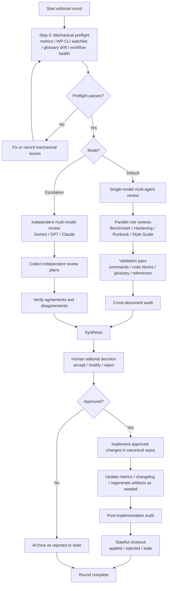

# Editorial Workflow Diagram

Mermaid diagram for the WordPress security document series editorial methodology.

This diagram summarizes the workflow described in:

- [AGENTS.md](../../AGENTS.md)
- [../PROCESS-SUMMARY.md](../PROCESS-SUMMARY.md)
- [single-model-multi-agent.md](single-model-multi-agent.md)
- [multi-model-editorial-board.md](multi-model-editorial-board.md)

## Workflow

## Reading Notes

- **Default mode** is the normal operating path for routine editorial work.
- **Escalation mode** adds independent external-model review when the revision scope or risk justifies it.
- **Synthesis** never bypasses the human editor.
- **Closeout** is not complete until every synthesized finding is archived as `applied`, `rejected`, or `stale`.
