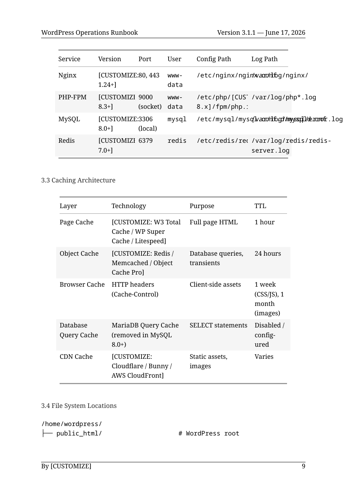

# Fresh documentation review — October 7, 2026

> **Archive note (2026-10-07):** This is the Codex (GPT-6.1 Sol) review as delivered, archived unchanged except for three path normalizations required by the portable-path check: the screenshot link now points at `assets/` in this directory, one home-directory path was shortened to `~`, and one quoted machine-local path was replaced with a placeholder. Verification, corrections, and dispositions are in `claude-review.md` and `synthesis.md`.

The series has a strong editorial structure, distinct audiences, useful primary-source links, and coherent shared tooling. Several published procedures and security claims still need correction before readers can rely on them operationally. The most urgent issues are authorization changes in the REST hardening example, incomplete or failing recovery steps, firewall access, and incident containment. Passing validation currently provides limited assurance about those behaviors.

This review covers the current public `main` of `ai-assisted-docs` and its four canonical security-document repositories. The three substantive review assignments used GPT-6.1 Sol with high reasoning. Findings were developed from the current sources, then checked against repository code and selected live primary authorities. Source documents were left unchanged. No live WordPress procedure, workflow dispatch, publication, or push was performed.

## Review snapshot

| Repository | Reviewed commit | Entry point |
|---|---|---|
| [ai-assisted-docs](https://github.com/dknauss/ai-assisted-docs) | `3b20749c4d93` | [README.md:1](https://github.com/dknauss/ai-assisted-docs/blob/3b20749c4d93bae8a39f6be5cc7d7219ab46a458/README.md#L1) |
| [wordpress-runbook-template](https://github.com/dknauss/wordpress-runbook-template) | `77bbeaf45186` | [WP-Operations-Runbook.md:1](https://github.com/dknauss/wordpress-runbook-template/blob/77bbeaf4518671d03da90da25027e7c91a63a663/WP-Operations-Runbook.md#L1) |
| [wp-security-benchmark](https://github.com/dknauss/wp-security-benchmark) | `466baa467efc` | [WordPress-Security-Benchmark.md:1](https://github.com/dknauss/wp-security-benchmark/blob/466baa467efcb133e79de4e9f1e948d75eaf8589/WordPress-Security-Benchmark.md#L1) |
| [wp-security-hardening-guide](https://github.com/dknauss/wp-security-hardening-guide) | `dfeffeeae199` | [WordPress-Security-Hardening-Guide.md:1](https://github.com/dknauss/wp-security-hardening-guide/blob/dfeffeeae199d91ea9d82a8fe677b0383fb8e6bf/WordPress-Security-Hardening-Guide.md#L1) |
| [wp-security-style-guide](https://github.com/dknauss/wp-security-style-guide) | `a92f9d440846` | [WP-Security-Style-Guide.md:1](https://github.com/dknauss/wp-security-style-guide/blob/a92f9d440846cedb36437547a63888d300c60be7/WP-Security-Style-Guide.md#L1) |

All four primary documents and checked-in PDFs carry June 17, 2026 publication dates. Versions are Runbook 3.1.1, Benchmark 1.1.1, Hardening Guide 1.1.1, and Style Guide 1.2.1. The optional performance series is listed as a separate local onboarding effort and was outside this review.

## Prioritized revision plan

High means a documented procedure can weaken authorization, leave an important protection absent, block recovery/access, or fail a promised publication path. Some effects depend on the explicitly described deployment configuration. Medium means incomplete audits, materially misleading definitions, or maintenance defects. Low denotes editorial/discoverability polish. No deployment exploitability was measured.

| Priority | Finding and consequence | First source anchor | Details |
|---|---|---|---|
| High | REST user-enumeration snippet replaces operation-specific authorization with `list_users`, including mutation handlers. Preserve core permissions and restrict reads separately. | [WP-Operations-Runbook.md:639](https://github.com/dknauss/wordpress-runbook-template/blob/77bbeaf4518671d03da90da25027e7c91a63a663/WP-Operations-Runbook.md#L639) | RB-1 |
| High | Full restore uses SQL/import while MySQL remains stopped; it also omits the separate uploads archive. Repair and rehearse the complete recovery sequence. | [WP-Operations-Runbook.md:2562](https://github.com/dknauss/wordpress-runbook-template/blob/77bbeaf4518671d03da90da25027e7c91a63a663/WP-Operations-Runbook.md#L2562), [WP-Operations-Runbook.md:2570](https://github.com/dknauss/wordpress-runbook-template/blob/77bbeaf4518671d03da90da25027e7c91a63a663/WP-Operations-Runbook.md#L2570) | RB-2, RB-3 |
| High | Configuration mode 400 conflicts with the stated `www-data` FPM identity and deployment ownership. Choose permissions from the actual runtime UID/GID. | [WP-Operations-Runbook.md:200](https://github.com/dknauss/wordpress-runbook-template/blob/77bbeaf4518671d03da90da25027e7c91a63a663/WP-Operations-Runbook.md#L200), [WP-Operations-Runbook.md:2603](https://github.com/dknauss/wordpress-runbook-template/blob/77bbeaf4518671d03da90da25027e7c91a63a663/WP-Operations-Runbook.md#L2603) | RB-4 |
| High | UFW is enabled before SSH is allowed; the later example SSH port change lacks a matching firewall transition. Stage and verify access before activation. | [WP-Operations-Runbook.md:480](https://github.com/dknauss/wordpress-runbook-template/blob/77bbeaf4518671d03da90da25027e7c91a63a663/WP-Operations-Runbook.md#L480) | RB-5 |
| High | Incident containment relies on ten-minute maintenance mode; the alternative Nginx deny/allow order blocks the intended admin exception. Require durable, verified containment. | [WP-Operations-Runbook.md:2233](https://github.com/dknauss/wordpress-runbook-template/blob/77bbeaf4518671d03da90da25027e7c91a63a663/WP-Operations-Runbook.md#L2233) | RB-6 |
| High | The selected Two Factor plugin has no built-in role-enforcement settings. Installation and user listing do not verify mandatory MFA. | [WP-Operations-Runbook.md:688](https://github.com/dknauss/wordpress-runbook-template/blob/77bbeaf4518671d03da90da25027e7c91a63a663/WP-Operations-Runbook.md#L688) | RB-7 |
| High | PHP audits read CLI settings rather than the effective serving SAPI/pool. An unhardened FPM runtime can pass. | [WordPress-Security-Benchmark.md:330](https://github.com/dknauss/wp-security-benchmark/blob/466baa467efcb133e79de4e9f1e948d75eaf8589/WordPress-Security-Benchmark.md#L330) | BB-1 |
| High | `xmlrpc_enabled` is described as complete endpoint disabling across the series. Its authenticated-method scope leaves unauthenticated methods available. | [WordPress-Security-Benchmark.md:872](https://github.com/dknauss/wp-security-benchmark/blob/466baa467efcb133e79de4e9f1e948d75eaf8589/WordPress-Security-Benchmark.md#L872), [WordPress-Security-Hardening-Guide.md:220](https://github.com/dknauss/wp-security-hardening-guide/blob/dfeffeeae199d91ea9d82a8fe677b0383fb8e6bf/WordPress-Security-Hardening-Guide.md#L220), [WP-Security-Style-Guide.md:657](https://github.com/dknauss/wp-security-style-guide/blob/a92f9d440846cedb36437547a63888d300c60be7/WP-Security-Style-Guide.md#L657) | BB-2 / HS-02, same underlying issue |
| High | Role provisioning with `add_role()` is overstated as protection against database tampering. Existing roles and assignments remain database-backed. | [WordPress-Security-Benchmark.md:1347](https://github.com/dknauss/wp-security-benchmark/blob/466baa467efcb133e79de4e9f1e948d75eaf8589/WordPress-Security-Benchmark.md#L1347), [WordPress-Security-Hardening-Guide.md:339](https://github.com/dknauss/wp-security-hardening-guide/blob/dfeffeeae199d91ea9d82a8fe677b0383fb8e6bf/WordPress-Security-Hardening-Guide.md#L339) | BB-3 / HS-04, same underlying issue |
| High | Upload PHP-denial sample omits Nginx regex-location ordering; SSH key-only sample omits alternative interactive authentication and effective-config verification. | [WordPress-Security-Benchmark.md:231](https://github.com/dknauss/wp-security-benchmark/blob/466baa467efcb133e79de4e9f1e948d75eaf8589/WordPress-Security-Benchmark.md#L231), [WordPress-Security-Benchmark.md:2070](https://github.com/dknauss/wp-security-benchmark/blob/466baa467efcb133e79de4e9f1e948d75eaf8589/WordPress-Security-Benchmark.md#L2070) | BB-4, BB-5 |
| High | The Hardening Guide promises security backports to 3.7. Application-password descriptions imply per-credential permission scope that core does not provide. | [WordPress-Security-Hardening-Guide.md:52](https://github.com/dknauss/wp-security-hardening-guide/blob/dfeffeeae199d91ea9d82a8fe677b0383fb8e6bf/WordPress-Security-Hardening-Guide.md#L52), [WordPress-Security-Hardening-Guide.md:88](https://github.com/dknauss/wp-security-hardening-guide/blob/dfeffeeae199d91ea9d82a8fe677b0383fb8e6bf/WordPress-Security-Hardening-Guide.md#L88), [WP-Security-Style-Guide.md:411](https://github.com/dknauss/wp-security-style-guide/blob/a92f9d440846cedb36437547a63888d300c60be7/WP-Security-Style-Guide.md#L411) | HS-01, HS-03 |
| High | AI guidance conflates display sanitization with safely executing generated code and overstates prompt-input sanitization. Make review, isolation, and deterministic authorization explicit alongside existing access controls. | [WordPress-Security-Hardening-Guide.md:553](https://github.com/dknauss/wp-security-hardening-guide/blob/dfeffeeae199d91ea9d82a8fe677b0383fb8e6bf/WordPress-Security-Hardening-Guide.md#L553) | HS-05 |
| High | The reusable workflow loads a local action from the caller checkout; external callers without that action fail. The current four downstream workflows avoid this through a pinned remote action. | [.github/workflows/reusable-generate-docs.yml:53](https://github.com/dknauss/ai-assisted-docs/blob/3b20749c4d93bae8a39f6be5cc7d7219ab46a458/.github/workflows/reusable-generate-docs.yml#L53) | PP-1 |
| High | All four contributor guides promise automatic rebuild, visual validation, and commits after merge; current generation is manual and uploads a bundle. Document the actual publication procedure. | [CONTRIBUTING.md:102](https://github.com/dknauss/wordpress-runbook-template/blob/77bbeaf4518671d03da90da25027e7c91a63a663/CONTRIBUTING.md#L102) | PP-2 |
| Medium | Correct incomplete autoload, session, rate-limit, secret-storage, and configuration audits; repair offload-option and WebP examples. | [WP-Operations-Runbook.md:2419](https://github.com/dknauss/wordpress-runbook-template/blob/77bbeaf4518671d03da90da25027e7c91a63a663/WP-Operations-Runbook.md#L2419), [WordPress-Security-Benchmark.md:1963](https://github.com/dknauss/wp-security-benchmark/blob/466baa467efcb133e79de4e9f1e948d75eaf8589/WordPress-Security-Benchmark.md#L1963) | RB-8–10, BB-6–8 |
| Medium | Correct glossary SSRF and nonce boundaries, `open_basedir` profile, SOC 2 terminology, XML-RPC amplification history, and MFA secret-storage expectations. | [WP-Security-Style-Guide.md:613](https://github.com/dknauss/wp-security-style-guide/blob/a92f9d440846cedb36437547a63888d300c60be7/WP-Security-Style-Guide.md#L613), [WP-Security-Style-Guide.md:535](https://github.com/dknauss/wp-security-style-guide/blob/a92f9d440846cedb36437547a63888d300c60be7/WP-Security-Style-Guide.md#L535) | HS-06–11 |
| Medium | Refresh the explicitly current supported-release examples and add a recorded 7.1 security/API delta review. | [WordPress-Security-Benchmark.md:18](https://github.com/dknauss/wp-security-benchmark/blob/466baa467efcb133e79de4e9f1e948d75eaf8589/WordPress-Security-Benchmark.md#L18) | BB-9; follow-up scope below |
| Medium | Fix skill metadata and installed references, empty review snapshots, and rebuild-wait failure reporting. Strengthen validation around those actual contracts. | [wp-docs-skills/security-researcher/SKILL.md:1](https://github.com/dknauss/ai-assisted-docs/blob/3b20749c4d93bae8a39f6be5cc7d7219ab46a458/wp-docs-skills/security-researcher/SKILL.md#L1) | PP-3–6 |
| Medium | Repair the unreadable runbook PDF service-reference table and the glossary metric that counts unrelated headings. | [WP-Operations-Runbook.md:197](https://github.com/dknauss/wordpress-runbook-template/blob/77bbeaf4518671d03da90da25027e7c91a63a663/WP-Operations-Runbook.md#L197), [docs/current-metrics.md:14](https://github.com/dknauss/wp-security-style-guide/blob/a92f9d440846cedb36437547a63888d300c60be7/docs/current-metrics.md#L14) | R-01, R-02 below |
| Low | Restore glossary ordering/valid references, clarify internal communication workflow boundaries, and advertise the existing rebuild helper. | [WP-Security-Style-Guide.md:391](https://github.com/dknauss/wp-security-style-guide/blob/a92f9d440846cedb36437547a63888d300c60be7/WP-Security-Style-Guide.md#L391), [README.md:105](https://github.com/dknauss/ai-assisted-docs/blob/3b20749c4d93bae8a39f6be5cc7d7219ab46a458/README.md#L105) | HS-12–13, PP-7 |

The XML-RPC and roles-in-code findings arose in both technical assignments and are grouped here. These are corroborated same-model reviews, with primary-source verification; they are not independent multi-model consensus.

## Verification results and practical limits

| Check | Result | What the result establishes |
|---|---|---|
| Full editorial preflight with all four siblings required | Passed | Portable-path check, aggregate metrics, WP-CLI command paths, regression and glossary watchlists, skill-file/link integrity. |
| Downstream metric validators | Passed: 13 Runbook, 18 Benchmark, 7 Hardening, 9 Style checks | Counts match their current commands; the glossary count's semantic defect remains R-02. |
| WP-CLI source-driven validator | Passed, 152 command lines | Recognized extracted command paths. It does not establish complete flag validity, correct permissions, runtime behavior, or procedure order. |
| Strict release metadata validation | Passed in all four | Current frontmatter versions/dates agree with their changelog release headings. |
| Artifact structure, title/markers, PDF version, phrase parity | Passed in all four | Existing validators were imported unchanged; `pypdf` PDF extraction replaced unavailable `pdftotext`. These are marker/parity smoke checks, not full text equivalence or layout assurance. |
| Relative Markdown file targets in current docs, outside archived reviews/planning | No missing file targets found | Existence checks only; fragment IDs and the complete external-link set were not audited. |
| PDF visual inspection | Four selected pages inspected | Runbook physical pages 5/10 and Style physical pages 5/13. Runbook service table is visibly defective. This is a sample, not a complete PDF accessibility/layout audit. |
| Local workflow lint | Not run: `actionlint` unavailable | Existing GitHub validation history supplies additional evidence; no fresh build or lint success is claimed. |

Current shared-repository preflight and aggregate-metrics runs are successful at the reviewed commit: [preflight](https://github.com/dknauss/ai-assisted-docs/actions/runs/29280201514), [metrics](https://github.com/dknauss/ai-assisted-docs/actions/runs/29280201531). The shared reusable-workflow smoke test last succeeded June 17 at an earlier commit; its self-repository fixture does not cover the external caller defect.

The latest checked PDF-visual runs on September 14 used the reviewed `main` commits. [Benchmark](https://github.com/dknauss/wp-security-benchmark/actions/runs/34870931099) and [Hardening](https://github.com/dknauss/wp-security-hardening-guide/actions/runs/34870938067) succeeded. [Runbook](https://github.com/dknauss/wordpress-runbook-template/actions/runs/34870927408) failed on page 10, dHash 33 against a maximum 30. [Style](https://github.com/dknauss/wp-security-style-guide/actions/runs/34870934765) failed on page 5, dHash 25 against a maximum 20. The failing validation steps and their filtered logs were read. These are existing observed failures, not newly dispatched tests.

The Style sample remains legible under Poppler. Its screenshot regression/baseline mismatch needs investigation before a baseline refresh. The root cause of either CI mismatch is unproven; the runbook defect below is confirmed separately by visual inspection.

## Additional verified publication and measurement findings

### R-01 — Medium: Runbook service-reference table is unreadable in the published PDF

**Location:** [WP-Operations-Runbook.md:197](https://github.com/dknauss/wordpress-runbook-template/blob/77bbeaf4518671d03da90da25027e7c91a63a663/WP-Operations-Runbook.md#L197), §3.2; checked-in PDF physical page 10, printed page 9.

The six-column table collides across Version/Port and Config Path/Log Path columns. Configuration and log paths overlap, and the MySQL row extends beyond the right margin. This undermines a reference intended for operators. The adjacent caching table renders legibly, so the finding is specific to the service table's layout.

Reformat the table into fewer columns or per-service blocks; support wrapping at path boundaries. Regenerate the outputs and visually inspect actual paths and table edges before accepting new baselines. Status: **Verified, open**. No generated document was changed.

### R-02 — Medium: The glossary metric passes while counting unrelated headings

**Location:** [docs/current-metrics.md:14](https://github.com/dknauss/wp-security-style-guide/blob/a92f9d440846cedb36437547a63888d300c60be7/docs/current-metrics.md#L14); the same definition propagates to the aggregate metric. Actual glossary: [WP-Security-Style-Guide.md:385](https://github.com/dknauss/wp-security-style-guide/blob/a92f9d440846cedb36437547a63888d300c60be7/WP-Security-Style-Guide.md#L385), §8.

There are **139 glossary entry labels**, while the canonical metrics report **143**. The verifier counts every line beginning with bold text throughout the document. Four unrelated labels at lines 689, 699, 707, and 732 inflate the total. Both the downstream and aggregate checks pass because they share this definition.

Scope the count to §8 and its entry pattern, update both metrics sources, and ensure headings outside the glossary do not change the term count. Status: **Verified, open**, independently rechecked by the process reviewer. This is a counting defect; it does not establish four missing definitions.

## Recommended work sequence

1. Repair the runbook's authorization, recovery, filesystem, firewall, containment, and MFA enforcement procedures. Review matching Benchmark examples together. Verify each fix in a disposable representative stack with behavioral checks, including denied requests and restore-to-empty-target drills.
2. Correct the cross-series security semantics: XML-RPC, roles, application passwords, support/backport policy, prompt/code execution, effective PHP/SSH settings, and Nginx routing. Carry the same boundaries into the glossary and classification matrices.
3. Align contributor guidance with the intended publication contract, fix external reusable-workflow consumption, and resolve the runbook table plus existing visual failures. Validate a real consumer fixture and the generated bundle that will be published.
4. Repair skill discovery/installation, metrics/snapshot definitions, and rebuild exit handling. Finish glossary ordering, references, and lower-priority onboarding polish.

The [October 6 WordPress 7.1.3 security release](https://wordpress.org/news/2026/10/wordpress-7-1-3-maintenance-and-security-release/) confirms the current release and distinguishes courtesy backports, currently through 4.7, from active support for the most recent version. The Hardening Guide's June scope through 7.0 is a dated scope rather than proof that every 7.0 statement is wrong. The [7.1 release](https://wordpress.org/news/2026/08/mary-lou/) introduces a filterable Abilities execution lifecycle among other changes. A focused 7.1/7.1.x security, authentication, REST/Abilities, and AI integration delta review should extend the declared verification scope. This pass does not assert a fully reviewed 7.1 compatibility baseline.

## What is worth preserving

The audience separation is useful: Benchmark controls, architectural rationale, operator procedures, and editorial standards each have their place. Keep the emergency reference card, procedure ownership and drill expectations, proportionate disclosure guidance, primary-source hierarchy, AI authorship transparency, and protected Style Guide foundation. The current eight-privilege database guidance and distinctions between `DISALLOW_FILE_EDIT` and optional `DISALLOW_FILE_MODS` are broadly aligned. The main next investment should be behavioral verification and accurate publication instructions, with selective editorial cleanup afterward.

The detailed reviews below include source evidence, proposed acceptance checks, additional findings, and explicit open questions. Suggested checks are future verification work unless the verification table above records them as performed. No live deployment, exhaustive annual-report/statistics validation, fresh publication build, or comprehensive external-link/fragment audit was performed.

---

## Detailed review A: operational procedures and benchmark controls

Reviewed 2026-10-07 against fresh public main clones. Source was read-only. No WordPress procedure was executed, no live site was accessed, and no source document was edited. Findings were developed from current primary documents without consulting archived reviews.

Source revisions:

- `wordpress-runbook-template/WP-Operations-Runbook.md`: `77bbeaf4518671d03da90da25027e7c91a63a663` (Runbook below).
- `wp-security-benchmark/WordPress-Security-Benchmark.md`: `466baa467efcb133e79de4e9f1e948d75eaf8589` (Benchmark below).

Applied the repository's `wordpress-security-doc-editor` and `wordpress-runbook-ops` skills, ai-assisted-docs AGENTS.md and relevant CLAUDE.md files, plus user-level remote WordPress safety rules. Verification below means source/manual verification, not successful execution in a WordPress installation. Severity reflects consequences when readers follow the examples in the stated environment.

### Priority findings

#### RB-1 — High: User-enumeration hardening replaces authorization for write operations

Source anchor: [WP-Operations-Runbook.md:639](https://github.com/dknauss/wordpress-runbook-template/blob/77bbeaf4518671d03da90da25027e7c91a63a663/WP-Operations-Runbook.md#L639)

- **Document/location:** Runbook §5.4, lines 639–650 (especially 642–643 and 649–650).
- **Finding:** The loop changes every handler on the users collection and individual-user routes to authorize only `list_users`. Those routes also contain POST, PUT/PATCH, and DELETE handlers. The original per-operation checks are discarded. An account with a custom role that may list users but may not edit them can pass the new check and modify another user's email/password; the handler does not repeat the original `edit_user` check. This is a security regression in a security remediation example, particularly relevant because the document series recommends custom least-privilege roles.
- **Recommendation:** Restrict public read exposure while preserving each original permission callback. Apply the added condition only to read handlers, or combine an additional denial condition with the existing callback rather than replacing it. Retain self-profile access where policy requires it. Align the runbook with the Benchmark's approach, which does not replace mutation permissions.
- **Verification/status:** **Verified** against [core route registration](https://developer.wordpress.org/reference/classes/wp_rest_users_controller/register_routes/), [update permission checks](https://developer.wordpress.org/reference/classes/wp_rest_users_controller/update_item_permissions_check/), and [update handler](https://developer.wordpress.org/reference/classes/wp_rest_users_controller/update_item/). Acceptance: a disposable test role with `list_users` but without `edit_users`, `create_users`, or `delete_users` cannot change another user through REST.

#### RB-2 — High: Full restore attempts database operations while MySQL is stopped

Source anchor: [WP-Operations-Runbook.md:2562](https://github.com/dknauss/wordpress-runbook-template/blob/77bbeaf4518671d03da90da25027e7c91a63a663/WP-Operations-Runbook.md#L2562)

- **Document/location:** Runbook §11.2, line 2562; SQL/import at 2585–2597; first restart at 2658.
- **Finding:** Step 1 stops MySQL. Step 3 then connects with `mysql` and imports through WP-CLI, while MySQL is not restarted until step 8. On the documented self-managed local database stack, both operations fail. This blocks the advertised full recovery procedure after the existing web root has already been moved aside.
- **Recommendation:** Keep HTTP/PHP services isolated, start and validate the database service before creating the database/user or importing, and explicitly select the target WordPress path/user. Include readiness and connection checks before proceeding.
- **Verification/status:** **Verified** by procedure sequencing and the documented client behavior in [WP-CLI db import](https://developer.wordpress.org/cli/commands/db/import/). Acceptance: a clean-host drill follows the procedure in order and completes SQL creation/import before web traffic resumes.

#### RB-3 — High: Full restore never restores the separate uploads backup

Source anchor: [WP-Operations-Runbook.md:1482](https://github.com/dknauss/wordpress-runbook-template/blob/77bbeaf4518671d03da90da25027e7c91a63a663/WP-Operations-Runbook.md#L1482)

- **Document/location:** Runbook §7.2, lines 1482–1492; §11.2, lines 2570–2580 and 2669–2670.
- **Finding:** The backup script deliberately separates uploads into `uploads_TIMESTAMP.tar.gz` and excludes them from the WordPress files archive. Full restore extracts only `wordpress_TIMESTAMP.tar.gz` and imports the database. It never extracts the uploads archive. Readers following the intended archive split lose media availability after a clean-server restore, despite the final requirement to verify media loads.
- **Recommendation:** Require a matching uploads artifact and restore it before permission normalization and service startup. Verify representative original images and generated sizes. Document snapshot consistency between database, files, and uploads.
- **Verification/status:** **Verified** by cross-reading the backup and restore steps. [WordPress file-backup guidance](https://developer.wordpress.org/advanced-administration/security/backup/files/) establishes the need to retain media. Acceptance: restore a post with uploaded media to an empty target using the three generated artifacts.

#### RB-4 — High: The permission reset removes PHP-FPM's access to configuration

Source anchor: [WP-Operations-Runbook.md:2603](https://github.com/dknauss/wordpress-runbook-template/blob/77bbeaf4518671d03da90da25027e7c91a63a663/WP-Operations-Runbook.md#L2603)

- **Document/location:** Runbook §3.2 line 200; §11.2 lines 2603–2608; Appendix A lines 2861, 2902, 2912. Companion Benchmark §6.1 lines 1431–1434 and §6.2 lines 1478–1483 also require a readability qualification.
- **Finding:** The runbook's reference pool runs as `www-data`, while the reset/restore assigns the configuration to `wp_user` and sets mode 400. A distinct `www-data` process cannot read that file, even when it belongs to the file's group. Following the defaults can produce a PHP failure immediately after a restore or permission reset. Mode selection is described primarily in terms of write access, but read access is mandatory.
- **Recommendation:** Specify the actual FPM UID/GID and ownership model first. Use 400 only when that runtime user is the owner, or an appropriate dedicated group and 440 when deployment ownership differs. Verify effective runtime read access and a request before ending the change window. Ensure writable uploads requirements are covered by the chosen model too.
- **Verification/status:** **Verified** by the document's explicit UID/mode combination and Unix permission semantics; [WordPress file-permissions guidance](https://developer.wordpress.org/advanced-administration/server/file-permissions/) and [FPM pool configuration](https://www.php.net/manual/en/install.fpm.configuration.php). No particular deployment was inspected.

#### RB-5 — High: Firewall procedure enables UFW before allowing SSH

Source anchor: [WP-Operations-Runbook.md:480](https://github.com/dknauss/wordpress-runbook-template/blob/77bbeaf4518671d03da90da25027e7c91a63a663/WP-Operations-Runbook.md#L480)

- **Document/location:** Runbook §5.1 lines 478–494; subsequent SSH port change at 509–510.
- **Finding:** Line 480 enables the firewall before line 483 allows SSH, contradicting the immediately following instruction to do SSH first. On a fresh deny-incoming setup this can interrupt access before the operator reaches the allow command. The same procedure later switches SSH to the example port 2222, while UFW allows only port 22.
- **Recommendation:** Resolve the actual SSH port, stage its allow rule and HTTP/HTTPS rules, then enable UFW. When changing ports, temporarily allow both ports, validate a second session on the new port, and remove the old rule only afterward. Match the safer ordering already shown in Benchmark §12.3.
- **Verification/status:** **Verified** against the current procedure and [Ubuntu UFW documentation](https://wiki.ubuntu.com/UFW). Acceptance: a staging VM with UFW initially inactive remains reachable through the whole procedure.

#### RB-6 — High: Breach containment relies on expiring application maintenance mode

Source anchor: [WP-Operations-Runbook.md:2233](https://github.com/dknauss/wordpress-runbook-template/blob/77bbeaf4518671d03da90da25027e7c91a63a663/WP-Operations-Runbook.md#L2233)

- **Document/location:** Runbook §10.3 lines 2231–2240.
- **Finding:** The first containment option says `wp maintenance-mode activate` takes the site offline to prevent further exfiltration. WP-CLI delegates to WordPress upgrade maintenance mode, whose timestamp expires after ten minutes; it is not durable network isolation and cannot contain arbitrary malicious PHP or outbound traffic. The incident is estimated at 1–4 hours. The alternative Nginx example puts `deny all` before the admin allow rule, so its stated admin exception never matches.
- **Recommendation:** Make containment an explicit edge/host control that stays active until released, including origin/direct-IP access and outbound controls where needed. Use `allow <admin-IP>; deny all;` in the correct Nginx context if an admin exception is required, and verify both permitted and denied requests. Label application maintenance mode only as a short operational convenience.
- **Verification/status:** **Verified** against [WP-CLI maintenance command source](https://raw.githubusercontent.com/wp-cli/maintenance-mode-command/main/src/MaintenanceModeCommand.php), [core maintenance timeout](https://developer.wordpress.org/reference/functions/wp_is_maintenance_mode/), and [Nginx access-rule ordering](https://nginx.org/en/docs/http/ngx_http_access_module.html).

#### RB-7 — High: Standardized 2FA procedure instructs operators to use a nonexistent enforcement setting

Source anchor: [WP-Operations-Runbook.md:688](https://github.com/dknauss/wordpress-runbook-template/blob/77bbeaf4518671d03da90da25027e7c91a63a663/WP-Operations-Runbook.md#L688)

- **Document/location:** Runbook §5.5 lines 688–702; Benchmark §5.1 lines 1046, 1057–1060; Hardening Guide §8.1 lines 290–302.
- **Finding:** The runbook tells operators to enforce 2FA for privileged roles in `two-factor` settings. The official plugin FAQ explicitly says there are no built-in role-enforcement settings. Its verification only establishes activation and user inventory; it does not establish enrollment or mandatory challenge behavior. Thus readers cannot complete the specified procedure and may mistake installation for enforcement.
- **Recommendation:** Separate installation, per-user enrollment, and enforcement. Name and verify an approved enforcement implementation or document maintained custom logic; test an unenrolled privileged account and attempts to disable 2FA. For current plugin versions, use the documented read-only `wp two-factor status <user>` to assist per-user verification, with the required plugin annotation/version floor.
- **Verification/status:** **Verified** against the [official Two Factor plugin FAQ and command documentation](https://wordpress.org/plugins/two-factor/), checked live on 2026-10-07. This is an enforcement-interface gap, not a claim that the plugin cannot be extended.

#### BB-1 — High: PHP security audits measure CLI settings rather than the serving runtime

Source anchor: [WordPress-Security-Benchmark.md:330](https://github.com/dknauss/wp-security-benchmark/blob/466baa467efcb133e79de4e9f1e948d75eaf8589/WordPress-Security-Benchmark.md#L330)

- **Document/location:** Benchmark §2.1 line 330; §2.2 line 368; §2.3 line 416; §2.4 line 453; §2.5 line 490. Also Runbook outage triage line 2161.
- **Finding:** Every PHP audit runs `php -i` (or `php -r`) and treats the result as the site's PHP setting. CLI can use a different PHP version, `php.ini`, and configuration from FPM/Apache; pool overrides also matter. A hardened CLI and unhardened serving runtime can therefore pass the benchmark, and outage triage can report the wrong memory limit.
- **Recommendation:** Identify the serving SAPI/version/pool and loaded configuration, inspect its effective settings and overrides, and validate response behavior where relevant. If a temporary runtime probe is needed, make it private, minimal, and remove it immediately; do not expose phpinfo publicly. Retain CLI checks only as explicitly separate checks.
- **Verification/status:** **Verified** against [PHP configuration-file selection](https://www.php.net/manual/en/configuration.file.php) and [FPM pool overrides](https://www.php.net/manual/en/install.fpm.configuration.php). Acceptance: deliberately different CLI/FPM settings are correctly detected by the revised audit.

#### BB-2 — High: `xmlrpc_enabled` is offered as full XML-RPC disablement

Source anchor: [WordPress-Security-Benchmark.md:850](https://github.com/dknauss/wp-security-benchmark/blob/466baa467efcb133e79de4e9f1e948d75eaf8589/WordPress-Security-Benchmark.md#L850)

- **Document/location:** Benchmark §4.4 lines 850–875; Runbook §5.4 lines 614–629; Hardening Guide line 220 and matrix line 614.
- **Finding:** All three documents present `add_filter( 'xmlrpc_enabled', '__return_false' )` as an alternative to blocking the endpoint. WordPress documents that this disables only authenticated XML-RPC methods, not pingbacks or unauthenticated/custom methods. Turning off Discussion notifications for new posts does not remove those methods or necessarily change existing posts. The Benchmark's GET audit also misses the normal 405 response from an enabled endpoint, so its status interpretation is incomplete.
- **Recommendation:** Label the filter's narrow effect and do not claim endpoint disablement. Prefer the server block when total disablement is policy; otherwise explicitly enumerate and remove/restrict relevant methods. Use a safe XML-RPC POST check and distinguish endpoint availability from method authorization.
- **Verification/status:** **Verified** by [the official xmlrpc_enabled hook documentation](https://developer.wordpress.org/reference/hooks/xmlrpc_enabled/). The GET-status issue should additionally be regression-tested against the supported core version.

#### BB-3 — High: Roles-in-code control overstates resistance to database privilege tampering

Source anchor: [WordPress-Security-Benchmark.md:1347](https://github.com/dknauss/wp-security-benchmark/blob/466baa467efcb133e79de4e9f1e948d75eaf8589/WordPress-Security-Benchmark.md#L1347)

- **Document/location:** Benchmark §5.8 lines 1347–1378; Hardening Guide §8.5 line 339.
- **Finding:** `add_role()` ordinarily persists definitions to the database and returns without changing an existing role. The example only adds `site_manager` if absent and removes one capability from `editor`. If a role already exists and has been given extra capabilities through database tampering, those capabilities remain. The prose says definitions are in code rather than the database and resistant to SQLi, but the demonstrated implementation does not enforce that boundary.
- **Recommendation:** Describe version-controlled provisioning and its limitations accurately, or supply a tested complete reconciliation/authoritative runtime model that detects unexpected capabilities. Explicitly distinguish role-definition protection from user-role/usermeta protection, which remains another privilege-escalation path.
- **Verification/status:** **Verified** against [WP_Roles::add_role source](https://developer.wordpress.org/reference/classes/wp_roles/add_role/). Acceptance: add an unauthorized capability to an existing custom role in a disposable fixture; the revised control must detect or remove it, rather than silently passing.

#### BB-4 — High: Upload PHP-denial sample omits location-order requirements

Source anchor: [WordPress-Security-Benchmark.md:231](https://github.com/dknauss/wp-security-benchmark/blob/466baa467efcb133e79de4e9f1e948d75eaf8589/WordPress-Security-Benchmark.md#L231)

- **Document/location:** Benchmark §1.4 lines 223–236.
- **Finding:** The upload denial is a regex location. Appending it after an existing generic PHP regex handler can leave uploaded PHP executable: Nginx selects the first matching regex location. The grep audit establishes presence, not effective routing. A reader can implement the exact sample and still fail the security goal.
- **Recommendation:** State placement relative to generic PHP handling and inspect effective configuration, then verify actual denied routing with an inert staging fixture. Cover the configured upload path and PHP extensions/handler patterns rather than assuming defaults.
- **Verification/status:** **Verified** against [Nginx location-selection rules](https://nginx.org/en/docs/http/ngx_http_core_module.html#location). Acceptance: test both a normal PHP request and an uploads PHP request with the site's complete configuration.

#### BB-5 — High: SSH key-only control does not close or audit interactive password authentication

Source anchor: [WordPress-Security-Benchmark.md:2070](https://github.com/dknauss/wp-security-benchmark/blob/466baa467efcb133e79de4e9f1e948d75eaf8589/WordPress-Security-Benchmark.md#L2070)

- **Document/location:** Benchmark §12.1 lines 2070–2093; Runbook §5.1 lines 505–507.
- **Finding:** `PasswordAuthentication no` and `PubkeyAuthentication yes` alone do not establish key-only authentication if keyboard-interactive/PAM password authentication is enabled. The grep audit also misses effective Include/Match settings. The control can pass with an alternative password path still available.
- **Recommendation:** For a genuinely key-only policy, disable keyboard-interactive password paths or specify `AuthenticationMethods publickey`; preserve an explicit exception for approved key-plus-MFA architectures. Validate with `sshd -t` and effective `sshd -T` settings for relevant user/host contexts, then test a separate key session before reload.
- **Verification/status:** **Verified** against the [OpenSSH sshd_config manual](https://man.openbsd.org/sshd_config), particularly KbdInteractiveAuthentication, AuthenticationMethods, Include, and Match. This is conditional on the effective host configuration, not an assertion that every Ubuntu installation permits interactive passwords by default.

### Additional actionable findings

#### RB-8 — Medium: Autoload diagnostics omit current WordPress values

Source anchor: [WP-Operations-Runbook.md:2419](https://github.com/dknauss/wordpress-runbook-template/blob/77bbeaf4518671d03da90da25027e7c91a63a663/WP-Operations-Runbook.md#L2419)

- **Document/location:** Runbook §10.5 lines 2419–2421.
- **Finding/consequence:** Both queries inspect only `autoload='yes'`. Since WordPress 6.6, the default autoload set also includes `on`, `auto-on`, and `auto`. These diagnostics undercount memory pressure and miss large offending options on the stated current-release target.
- **Recommendation:** Match the effective values returned by `wp_autoload_values_to_autoload()`; if documenting direct SQL, include the default set and explain filters. Verify against the amount actually loaded, not only legacy rows.
- **Verification/status:** **Verified** against [core's autoload-values function](https://developer.wordpress.org/reference/functions/wp_autoload_values_to_autoload/).

#### RB-9 — Medium: Offload settings command stores a JSON string and replaces the entire option

Source anchor: [WP-Operations-Runbook.md:1930](https://github.com/dknauss/wordpress-runbook-template/blob/77bbeaf4518671d03da90da25027e7c91a63a663/WP-Operations-Runbook.md#L1930)

- **Document/location:** Runbook §9.1 lines 1930–1934.
- **Finding/consequence:** `wp option update as3cf_settings '{...}'` defaults to plaintext, so the example stores a JSON string rather than decoding structured settings. Even adding `--format=json` would replace the complete option with only bucket/region, potentially losing existing plugin settings.
- **Recommendation:** Prefer the documented plugin configuration path, or verify the installed plugin's schema and make a backed-up, targeted update. If a JSON replacement is truly intended, use `--format=json`, preserve required existing keys, and verify the stored type and plugin behavior.
- **Verification/status:** **Verified** for WP-CLI serialization/replacement behavior by [wp option update](https://developer.wordpress.org/cli/commands/option/update/). Exact installed plugin option schema was not verified; do not assert a specific plugin runtime failure without that check.

#### RB-10 — Medium: Automatic WebP delivery has no file-existence fallback

Source anchor: [WP-Operations-Runbook.md:1900](https://github.com/dknauss/wordpress-runbook-template/blob/77bbeaf4518671d03da90da25027e7c91a63a663/WP-Operations-Runbook.md#L1900)

- **Document/location:** Runbook §9.1 lines 1900–1906.
- **Finding/consequence:** The comment promises to serve WebP only when a sidecar exists, but the condition checks only browser Accept. Any accepted request to an image without a corresponding `original.ext.webp` is rewritten to a missing file, causing broken images.
- **Recommendation:** Use an existence-aware `try_files`/map design with the original asset as fallback, and configure cache variation for content negotiated by Accept. Test both sidecar-present and sidecar-absent requests.
- **Verification/status:** **Verified** by the snippet's explicit condition and rewrite; [Nginx try_files documentation](https://nginx.org/en/docs/http/ngx_http_core_module.html#try_files).

#### BB-6 — Medium: REST rate-limit example misses the query-string API surface

Source anchor: [WordPress-Security-Benchmark.md:293](https://github.com/dknauss/wp-security-benchmark/blob/466baa467efcb133e79de4e9f1e948d75eaf8589/WordPress-Security-Benchmark.md#L293)

- **Document/location:** Benchmark §1.5 lines 259 and 293–296.
- **Finding/consequence:** The claim covers all API entry points, but the REST rule matches only `/wp-json/`. WordPress also routes requests through `?rest_route=/...`, including installations with plain permalinks. Those requests reach the same API without matching the sample REST location.
- **Recommendation:** Inventory actual externally reachable REST URLs, include query-string routes in the edge/rate-limit policy, and validate equivalent requests through both forms. Preserve the limit through internal redirects to PHP.
- **Verification/status:** **Verified** by [get_rest_url core source](https://developer.wordpress.org/reference/functions/get_rest_url/) and the sample regex's literal scope. Exact internal-redirect behavior depends on the full Nginx configuration.

#### BB-7 — Medium: Secret-storage audit prints the secrets it seeks to protect

Source anchor: [WordPress-Security-Benchmark.md:1963](https://github.com/dknauss/wp-security-benchmark/blob/466baa467efcb133e79de4e9f1e948d75eaf8589/WordPress-Security-Benchmark.md#L1963)

- **Document/location:** Benchmark §11.1 lines 1963–1964; §4.6 line 948.
- **Finding/consequence:** The API-key audit prints matching source lines and entire `option_value` contents, while the salt audit prints all eight live secrets. In recorded terminals, CI, tickets, or AI-assisted audits this creates additional copies of credentials. It also conflicts with the user's explicit never-print-secrets operating rule.
- **Recommendation:** Return filenames/option names, counts, and pass/fail assertions with redaction. Do not emit secret values or salts; review entropy/generation provenance locally through a controlled process. Use the active table prefix rather than the fixed `wp_options` name in the API-key query.
- **Verification/status:** **Verified** by the selected columns and grep behavior; [OWASP secrets-management guidance](https://cheatsheetseries.owasp.org/cheatsheets/Secrets_Management_Cheat_Sheet.html) supports minimizing exposure. No actual keys were read or printed during this review.

#### BB-8 — Medium: Session-control audit and remediation cover only part of the requirement

Source anchor: [WordPress-Security-Benchmark.md:1122](https://github.com/dknauss/wp-security-benchmark/blob/466baa467efcb133e79de4e9f1e948d75eaf8589/WordPress-Security-Benchmark.md#L1122)

- **Document/location:** Benchmark §5.3 lines 1122, 1130–1148.
- **Finding/consequence:** The description requires idle timeouts, minimized Remember Me, and session purging on role/capability changes; the audit merely finds an `auth_cookie_expiration` filter and the remediation only sets maximum lifetime. An installation can meet the sample and pass the stated audit while leaving the other explicit requirements unmet. Grep also cannot establish the filter is active or what duration it enforces.
- **Recommendation:** Split the requirements into separate measurable checks or supply implementation/verification for each. Include privileged-capability/Super Admin coverage rather than relying only on the `administrator` role name.
- **Verification/status:** **Verified** by requirement-to-audit/code comparison. [auth_cookie_expiration](https://developer.wordpress.org/reference/hooks/auth_cookie_expiration/) documents the lifetime hook's scope.

#### BB-9 — Medium: Target technology calls an older branch the current supported release

Source anchor: [WordPress-Security-Benchmark.md:18](https://github.com/dknauss/wp-security-benchmark/blob/466baa467efcb133e79de4e9f1e948d75eaf8589/WordPress-Security-Benchmark.md#L18)

- **Document/location:** Benchmark Target Technology line 18; Runbook site identity line 126 gives WordPress 7.0 as a current stable example.
- **Finding/consequence:** The Benchmark labels WordPress 7.0 the current supported release series. On the audit date the official site had released 7.1.3 on October 6, 2026 and explicitly states that only the most recent version is actively supported; older branch security backports are a courtesy. The static example and release policy are therefore stale, potentially misleading readers about a supported production baseline.
- **Recommendation:** State the verified current series with an as-of date, or separate tested compatibility from the requirement to run the latest supported release. Do not describe courtesy backports as full support. Update associated freshness statements together.
- **Verification/status:** **Verified** against [WordPress 7.1.3 release and support statement](https://wordpress.org/news/2026/10/wordpress-7-1-3-maintenance-and-security-release/) and [WordPress security policy](https://wordpress.org/about/security/), checked 2026-10-07. The historical May 20 release date was not reverified here.

### Strengths

- The Benchmark consistently exposes profile, assessment, rationale, impact, audit, remediation, defaults, and references, which provides a strong basis for actionable verification.
- The runbook puts an emergency card before the main content, provides critical procedure freshness metadata, and includes owners, escalation criteria, recovery validation, and drill expectations.
- The current documents correctly distinguish `DISALLOW_FILE_EDIT` baseline from optional `DISALLOW_FILE_MODS`, qualify table-prefix obscurity, avoid blanket REST authentication requirements, use the eight database privileges, prefer Composer install for release deployment, and warn against raw MySQL datadir deletion.
- Dedicated backup storage, incident evidence capture, revocation of application passwords, and known-good deployment artifacts are valuable operational requirements.

### Scope, limitations, and rejected/open issues

- This was a substantive manual technical review of the two primary Markdown documents and related Hardening Guide passages. It was not a full live-server audit, universal command execution test, complete link audit, artifact rendering review, or a vulnerability scan.
- Configuration-dependent examples require staging fixtures to validate the exact installation. Recommended acceptance tests above are future verification steps, not tests claimed to have run.
- Existing headings/centralized Appendix E metadata were not treated as cosmetic schema failures where they provide the required operational information. Missing routine-procedure blocks are lower priority than broken security and recovery steps.
- **Rejected as an asserted finding:** a blanket claim that Benchmark §3.1's `REVOKE ALL ... ON *.*` necessarily leaves database-scoped grants. Current [MySQL 8.0 REVOKE documentation](https://dev.mysql.com/doc/refman/8.0/en/revoke.html) describes that form as an all-privilege reset in one passage and discusses global scope elsewhere; that inconsistency requires a version-specific fixture/source investigation. Do not import an unverified historical assumption. Role-derived grants still warrant audit, but this review does not assert a complete remediation failure on that basis.
- **Open question:** Backup script's execution identity/log write permissions, AIDE distribution-specific paths, complete FPM pool snippet requirements, offload-plugin settings schema, update rollback artifact prerequisites, and whole-archive integrity checks deserve follow-up environment validation. They were not promoted to verified findings without the necessary fixture/source evidence.
- **Small verified editorial correction:** Runbook lines 283–285 say the HSTS `preload` directive submits a domain. Preload enrollment requires a separate submission process; the header signals eligibility/consent. This is low priority relative to the findings above.

---

## Detailed review B: architecture, terminology, and editorial alignment

Reviewed 2026-10-07, current public main snapshots: Hardening Guide `dfeffeeae199d91ea9d82a8fe677b0383fb8e6bf`; Style Guide `a92f9d440846cedb36437547a63888d300c60be7`. No source edits, live WordPress commands, or remote mutations. Read the documents independently before considering any archived reviews. Applied `ai-assisted-docs/AGENTS.md` and its `wordpress-security-doc-editor` skill. Style sections 1–2 were preserved as the human editorial foundation.

Canonical file locations below are repository-relative, so recommendations target the published source rather than review archives. Findings checked against current primary sources unless explicitly marked otherwise.

### Findings

#### HS-01 — High — Obsolete backport support floor creates false assurance

Source anchor: [WordPress-Security-Hardening-Guide.md:52](https://github.com/dknauss/wp-security-hardening-guide/blob/dfeffeeae199d91ea9d82a8fe677b0383fb8e6bf/WordPress-Security-Hardening-Guide.md#L52)

- **Document/location:** `wp-security-hardening-guide/WordPress-Security-Hardening-Guide.md`, §3.3 line 52 and §5 line 105.
- **Finding/impact:** The guide promises security updates back to WordPress 3.7 and calls older branches supported. Updates for 3.7–4.0 ended on December 1, 2022. Only the latest release is officially supported; older fixes are courtesy backports. The wording can justify retaining a branch that no longer receives security updates.
- **Recommendation:** Retain 3.7 only as the historical introduction of automatic updates. State current official support policy and describe courtesy backports without guaranteeing an enduring floor. Date any explicit backport range and verify it against current release notices.
- **Verification/status:** **Verified** against the [Security Team announcement](https://make.wordpress.org/security/2022/09/07/dropping-security-updates-for-wordpress-versions-3-7-through-4-0/) and [current security policy](https://wordpress.org/about/security/).

#### HS-02 — High — XML-RPC filter does not disable the whole endpoint

Source anchor: [WordPress-Security-Hardening-Guide.md:220](https://github.com/dknauss/wp-security-hardening-guide/blob/dfeffeeae199d91ea9d82a8fe677b0383fb8e6bf/WordPress-Security-Hardening-Guide.md#L220)

- **Document/location:** Hardening §7.2 line 220 and §15.6 classification matrix line 614; Style glossary `xmlrpc.php` line 657. Same claim appears in Benchmark §4.4 lines 872–875 and Runbook §5.4 lines 623–626.
- **Finding/impact:** `xmlrpc_enabled = false` is presented as an alternative to a web-server endpoint block. It disables authenticated methods only. Pingbacks and other unauthenticated methods remain available. Readers selecting the mu-plugin option do not obtain the attack-surface reduction the documents promise.
- **Recommendation:** Describe the filter as authenticated-method restriction. For complete removal retain server-level blocking and a verification procedure that exercises XML-RPC POST requests; if filtering methods is offered, enumerate the desired scope and test unauthenticated methods too. Align all four docs and the shared classification matrices.
- **Verification/status:** **Verified**; the [official hook documentation](https://developer.wordpress.org/reference/hooks/xmlrpc_enabled/) explicitly describes the limitation.

#### HS-03 — High — Application passwords are not privilege-scoped by core

Source anchor: [WordPress-Security-Hardening-Guide.md:88](https://github.com/dknauss/wp-security-hardening-guide/blob/dfeffeeae199d91ea9d82a8fe677b0383fb8e6bf/WordPress-Security-Hardening-Guide.md#L88)

- **Document/location:** Hardening A07 line 88 and §7.5 line 268; Style glossary `Application password` line 411.
- **Finding/impact:** All three descriptions call application passwords scoped credentials without specifying the scope. Core authenticates the owning user; it does not provide OAuth-style per-password capability or route scopes. Readers may give an integration an administrator's application password believing it has narrower authorization.
- **Recommendation:** Say individually named/revocable API credentials, with the owning user's capabilities. Recommend a dedicated integration account with least privilege or explicit additional scope enforcement. Distinguish API-only authentication from permission scope.
- **Verification/status:** **Verified** from current [core authentication source](https://developer.wordpress.org/reference/functions/wp_authenticate_application_password/) and the [integration guide's separate future scoping section](https://make.wordpress.org/core/2020/11/05/application-passwords-integration-guide/).

#### HS-04 — High — Code-defined roles are not inherently independent of database tampering

Source anchor: [WordPress-Security-Hardening-Guide.md:339](https://github.com/dknauss/wp-security-hardening-guide/blob/dfeffeeae199d91ea9d82a8fe677b0383fb8e6bf/WordPress-Security-Hardening-Guide.md#L339)

- **Document/location:** Hardening §8.5 line 339; related Benchmark §5.8 lines 1347–1349.
- **Finding/impact:** The guide claims defining roles in a mu-plugin rather than the database makes them resistant to SQL injection and privilege escalation. Normal `add_role()` stores roles in options, and returns early when a role already exists. Calling it on `init` does not by itself reassert a trusted definition after tampering. User-role assignments/capabilities also remain database-backed.
- **Recommendation:** Keep version-controlled role policy as an auditability benefit; remove the implied SQLi protection. Describe separate verification/reconciliation or runtime authorization enforcement only when an actual implementation is specified and tested. Make the Benchmark example and rationale match the real objective.
- **Verification/status:** **Verified** from [WP_Roles::add_role()](https://developer.wordpress.org/reference/classes/wp_roles/add_role/) and [role-data loading](https://developer.wordpress.org/reference/classes/wp_roles/get_roles_data/).

#### HS-05 — High — Prompt and code-execution guidance overstates sanitization

Source anchor: [WordPress-Security-Hardening-Guide.md:553](https://github.com/dknauss/wp-security-hardening-guide/blob/dfeffeeae199d91ea9d82a8fe677b0383fb8e6bf/WordPress-Security-Hardening-Guide.md#L553)

- **Document/location:** Hardening §14.3 lines 553–554.
- **Finding/impact:** Input sanitization is said to prevent prompt injection, and sanitizing/escaping is presented as preparation for executing AI output as code. Valid natural-language content can carry instructions, including indirect instructions in retrieved material. HTML escaping is not an authorization boundary or a safe-code execution strategy.
- **Recommendation:** Explain direct and indirect prompt injection and its limits. Add deterministic tool authorization, narrow inputs/operations, least-privilege credentials, isolation, and approval for high-impact actions. Split display sanitization from code handling; generated code requires review, validation, and controlled execution, not merely escaping.
- **Verification/status:** **Verified** against [OWASP LLM01:2025](https://genai.owasp.org/llmrisk/llm01-prompt-injection/), which describes mitigation limits and privilege/human approval controls. Implementation recommendation is an inference from those controls, not a WordPress core feature claim.

#### HS-06 — Medium — Glossary overstates default SSRF protection

Source anchor: [WP-Security-Style-Guide.md:613](https://github.com/dknauss/wp-security-style-guide/blob/a92f9d440846cedb36437547a63888d300c60be7/WP-Security-Style-Guide.md#L613)

- **Document/location:** Style glossary `SSRF`, line 613; contrast Hardening A01 line 64.
- **Finding/impact:** The glossary says core filters outbound HTTP requests to block loopback/private IPs and restrict ports. General HTTP API requests default `reject_unsafe_urls` to false. The safe wrappers opt in; the Hardening Guide correctly identifies them. The glossary can teach developers to use ordinary `wp_remote_get()` with attacker-controlled URLs without the required validation.
- **Recommendation:** Match the Hardening Guide: name `wp_safe_remote_*()` and URL validation, avoid implying all HTTP API calls enforce the safe policy, and retain egress restrictions as another layer.
- **Verification/status:** **Verified** from [WP_Http::request() defaults](https://developer.wordpress.org/reference/classes/wp_http/request/) and [wp_safe_remote_get()](https://developer.wordpress.org/reference/functions/wp_safe_remote_get/).

#### HS-07 — Medium — Nonce definition implies authentication

Source anchor: [WP-Security-Style-Guide.md:535](https://github.com/dknauss/wp-security-style-guide/blob/a92f9d440846cedb36437547a63888d300c60be7/WP-Security-Style-Guide.md#L535)

- **Document/location:** Style glossary `Nonce`, line 535.
- **Finding/impact:** A nonce is defined as verifying origin from a legitimate authenticated user. Nonces are request-intent/CSRF tokens, not authentication or authorization; guest nonces are also generated and default to the same user ID 0. The glossary omits the critical limitation even though it correctly explains replay/lifetime semantics.
- **Recommendation:** Define CSRF/request-intent purpose and explicitly state that authentication and capability checks are separate. Mention guest nonce limitations where relevant; cross-reference authentication/authorization.
- **Verification/status:** **Verified** against [official nonce guidance](https://developer.wordpress.org/apis/security/nonces/).

#### HS-08 — Medium — `open_basedir` classification contradicts the Benchmark

Source anchor: [WP-Security-Style-Guide.md:555](https://github.com/dknauss/wp-security-style-guide/blob/a92f9d440846cedb36437547a63888d300c60be7/WP-Security-Style-Guide.md#L555)

- **Document/location:** Style glossary `PHP security directives`, line 555; Hardening §6.3 line 163; Benchmark §2.4 line 440 and summary line 2344.
- **Finding/impact:** The glossary says all three listed PHP directives are Level 1. Benchmark explicitly makes `open_basedir` Level 2. Hardening presents the same directive in an undifferentiated runtime-hardening list. The glossary becomes an incorrect normative shortcut to the control profile.
- **Recommendation:** Distinguish L1 error/version disclosure controls from optional/environment-specific L2 `open_basedir`; label it consistently in Hardening. Review PHP documentation's limitation warning instead of describing the setting as a complete security boundary.
- **Verification/status:** **Verified** by direct cross-document comparison. External [PHP documentation](https://www.php.net/manual/en/ini.core.php#ini.open-basedir) is the appropriate limitation reference.

#### HS-09 — Medium — SOC 2 certification example contradicts the glossary

Source anchor: [WP-Security-Style-Guide.md:106](https://github.com/dknauss/wp-security-style-guide/blob/a92f9d440846cedb36437547a63888d300c60be7/WP-Security-Style-Guide.md#L106)

- **Document/location:** Style §3.6 line 106; Hardening §13 lines 524 and 527; contrast Style glossary `SOC 2` line 605.
- **Finding/impact:** The normative example identifies SOC 2 Type II as certification, while the glossary accurately identifies an attestation report. Hardening also groups SOC 2 and GDPR DPAs under certifications. Procurement readers can mistake a report's scoped examination for a general certificate.
- **Recommendation:** Use ISO/IEC 27001 for a certification example. Distinguish SOC 2 attestation reports, PCI DSS validation evidence, FedRAMP authorization, and contractual DPAs in hosting evaluation; require scope/date review.
- **Verification/status:** **Verified** through local contradiction and [AICPA's SOC suite description](https://www.aicpa-cima.com/resources/landing/system-and-organization-controls-soc-suite-of-services).

#### HS-10 — Medium — XML-RPC password amplification claim is outdated for current core

Source anchor: [WP-Security-Style-Guide.md:657](https://github.com/dknauss/wp-security-style-guide/blob/a92f9d440846cedb36437547a63888d300c60be7/WP-Security-Style-Guide.md#L657)

- **Document/location:** Style glossary `xmlrpc.php` line 657; Hardening §7.2 line 220; Benchmark §4.4 line 852.
- **Finding/impact:** Style says `system.multicall` batches multiple login attempts, Benchmark says hundreds of password attempts per HTTP request, and Hardening repeats amplification as the current rationale. Current core stops authenticating further login attempts after the first failure on the request's server instance. XML-RPC can still have abuse risks, but the familiar historical amplification mechanism is overstated as current behavior.
- **Recommendation:** Label historical behavior/version where relevant and explain remaining current risks, including authentication attempts across requests and pingback/resource abuse. Do not remove legitimate endpoint minimization merely because one rationale is stale.
- **Verification/status:** **Verified** from [`wp_xmlrpc_server::login()`](https://developer.wordpress.org/reference/classes/wp_xmlrpc_server/login/), specifically the `auth_failed` guard.

#### HS-11 — Medium — Recommended MFA implementation does not itself encrypt TOTP secrets

Source anchor: [WordPress-Security-Hardening-Guide.md:292](https://github.com/dknauss/wp-security-hardening-guide/blob/dfeffeeae199d91ea9d82a8fe677b0383fb8e6bf/WordPress-Security-Hardening-Guide.md#L292)

- **Document/location:** Hardening §8.1 lines 292 and 298; Runbook §5.5 recommends `two-factor`.
- **Finding/impact:** The guide both standardizes `two-factor` and requires encrypted 2FA secrets in the database without describing the implementation. The recommended plugin's TOTP provider directly stores/reads the secret in user meta. Database volume encryption may satisfy an at-rest objective, but would not protect the secret from SQL reads or database exports; the wording does not distinguish these threat models.
- **Recommendation:** State the intended encryption layer and threat model. If field encryption is required, name and verify the additional implementation or approved alternative; otherwise state the plugin's storage limitation and required database/backup protections. Do not imply installation of the recommended plugin fulfills all MFA controls.
- **Verification/status:** **Verified** storage implementation from [Two Factor TOTP provider](https://github.com/WordPress/two-factor/blob/master/providers/class-two-factor-totp.php), `get_user_totp_key()`/`set_user_totp_key()`. Whether a particular deployment's storage encryption meets policy is **not assessed**.

#### HS-12 — Low — Glossary ordering and references violate explicit maintenance rules

Source anchor: [WP-Security-Style-Guide.md:391](https://github.com/dknauss/wp-security-style-guide/blob/a92f9d440846cedb36437547a63888d300c60be7/WP-Security-Style-Guide.md#L391)

- **Document/location:** Style §8 line 387 (alphabetical promise); examples lines 391–393, 449–453, 591–603; missing targets at lines 451 (`WordPress`) and 519 (`allowlist`).
- **Finding/impact:** Current glossary has 139 entries but is not alphabetically ordered. Examples: Account takeover before Abilities API; Core-adjacent before Content Security Policy; SHA/SIEM before Session/Severity/Shadow; TOTP before TLS. Explicit cross-references to WordPress and allowlist have no glossary entries. This impairs lookup and fails the repo's declared acceptance criteria.
- **Recommendation:** Apply a documented case-insensitive alphabetical ordering convention and validate every `See also` target against entry names or an explicit alias map. Add entries or remove/change nonexistent references. Avoid treating minor punctuation sorting choices as substantive defects.
- **Verification/status:** **Verified** by parsing bold entry labels and manual spot checks; no external authority required.

#### HS-13 — Low — Operational routing policy remains in normative style chapter

Source anchor: [WP-Security-Style-Guide.md:316](https://github.com/dknauss/wp-security-style-guide/blob/a92f9d440846cedb36437547a63888d300c60be7/WP-Security-Style-Guide.md#L316)

- **Document/location:** Style §7.2 lines 316–326 and §7.6 line 369; separate workflow §9.
- **Finding/impact:** §7.6 says writing standards are stable and who/when procedures live in §9, but §7.2 still mandates customer emails and assigns decisions to Development/Support/Marketing. Those organization-specific procedures are a mismatch for the broad ecosystem audience and contradict the stated boundary.
- **Recommendation:** Keep severity language/score ranges in §7.2; move or clearly mark communication-channel defaults as a customizable internal example in §9. Preserve the general writing standard across organizations.
- **Verification/status:** **Verified** internal inconsistency. Editorial judgment, not a security defect.

### Open questions and non-findings

- **Majority of enterprise WordPress breaches involve credentials:** Hardening line 282 makes a WordPress-specific majority assertion; line 285 cites a cross-industry 22% credential initial-access figure. The cited context does not establish that majority. **Open Question:** provide WordPress enterprise telemetry with population/methodology or qualify the claim. Same paragraph's fastest-growing attack-category statement also needs a specific source. This review has not proved the claims false.
- **AI package boundary:** Hardening line 556 calls the linked functionality the WordPress 7.0 JavaScript AI API, while the [linked dev note](https://make.wordpress.org/core/2026/03/24/introducing-the-ai-client-in-wordpress-7-0/) says that wrapper is separately available and is not part of core. Style line 401 calls the built-in AI Client core-adjacent, which is imprecise in the opposite direction. This is a **verified clarification opportunity**, lower priority than HS-05: name the package/wrapper and distinguish the bundled PHP library/core wrapper from separate client-side prompt endpoints.
- **7.0 and PHP facts:** The May 20, 2026 7.0 release and PHP 8.3 recommendation were verified; do not claim these are fabricated. Sources: [7.0 release documentation](https://wordpress.org/documentation/wordpress-version/version-7.0/) and [requirements](https://wordpress.org/about/requirements/). The [field guide](https://make.wordpress.org/core/2026/05/14/wordpress-7-0-field-guide/) confirms AI Client, client-side Abilities API, Connectors screen/API.
- **7.1 currency:** Root reviewer separately verified 7.1.3 as the current October 6 maintenance/security release via [official releases](https://wordpress.org/news/category/releases/). Hardening line 15 explicitly scopes its June 17 edition to behavior through 7.0; that bounded claim does not itself become false when 7.1 ships. **Open Question:** perform a targeted 7.1.x security/authentication/AI surface delta review and decide whether to update the stated scope. Benchmark's claim that 7.0 is the current supported series is a separate definite currency defect; mechanical version replacement across historical introduction statements would be wrong.
- **Argon2 via Sodium:** Do not reject the glossary simply because it mentions Sodium. PHP 7.4 added an alternate password-hash implementation through Sodium: [implemented PHP RFC](https://wiki.php.net/rfc/sodium.argon.hash). Precise deployment availability should still be checked with the installed runtime.
- **Permissions:** The 400/440 `wp-config.php` guidance is qualified and follows [upstream hardening guidance](https://developer.wordpress.org/advanced-administration/security/hardening/); not a verified defect.
- **Glossary coverage:** Terms used in two or more canonical documents must be covered under AGENTS policy. This pass checked major security concepts but did not claim exhaustive token-based term discovery. For example, SLA occurs in Hardening governance and Runbook patch/incident procedures without a glossary entry, but whether SLA warrants addition is an editorial prioritization choice. RTO/RPO appear in the Runbook only as actual terms, so do not manufacture a two-document coverage finding from substring matches.

### Strengths and limits

The Hardening Guide largely keeps architecture guidance separate from the Benchmark's commands. Its supply-chain discussion correctly treats plugins as unsandboxed and frames dependencies, backups, process isolation, and governance as parts of one deployment. Shared database privilege lists and `DISALLOW_FILE_EDIT`/`DISALLOW_FILE_MODS` distinctions are aligned. Its route-specific REST approach avoids indiscriminate public API blocking. The guide's recent AI provider-secret guidance is grounded in primary dev notes.

The Style Guide offers a distinct editorial purpose, usable disclosure templates, global-reader checks, explicit proportionality, accurate current OWASP/CVSS/EPSS terminology, and a broad operationally relevant glossary. Its foundation deserves preservation. The main weakness is that a normative editorial document also contains technical implementation assertions; a mistake there can be propagated across the series as policy.

This is a documentation review, not a penetration test, legal compliance opinion, exhaustive citation audit, or live stack verification. Threat statistics' exact percentages/populations and all annual-report editions were not revalidated in this pass; the root review should incorporate separate source/freshness checks. Links to annual report landing pages are less reproducible than dated report/page anchors. Published PDF/DOCX/EPUB rendering was outside this subtask.

---

## Detailed review C: process, skills, and publication tooling

Reviewed the fresh `main` checkouts of `ai-assisted-docs` and the four canonical security document repositories on 2026-10-07. Read current instructions, READMEs, skills, contributor guidance, canonical metrics, tool scripts, and workflow definitions before considering historical review artifacts. No source edits, skill installation, workflow dispatch, remote WordPress operations, pushes, or external messages were performed.

### Verified actionable findings

#### PP-1 — High: reusable generation fails for external callers without a copied local action

Source anchor: [.github/workflows/reusable-generate-docs.yml:53](https://github.com/dknauss/ai-assisted-docs/blob/3b20749c4d93bae8a39f6be5cc7d7219ab46a458/.github/workflows/reusable-generate-docs.yml#L53)

- **Location:** `ai-assisted-docs/.github/workflows/reusable-generate-docs.yml:53` (checkout at 49–50); README:5 presents the validator badge as the reusable pipeline's health signal.
- **Finding:** The reusable workflow checks out the caller repository and then loads `./.github/actions/setup-docs-toolchain`. That action exists only in `ai-assisted-docs`; it is absent from all four canonical downstream checkouts. External callers without their own copy therefore fail at toolchain setup before document generation.
- **Verification:** GitHub's [official reusable workflow documentation](https://docs.github.com/en/actions/concepts/workflows-and-actions/reusing-workflow-configurations) confirms that `actions/checkout` in a called workflow checks out the repository hosting the caller. The self-test calls the reusable workflow from the same repository (`.github/workflows/_fixture-call-reusable-generate-docs.yml:11`), masking this dependency.
- **Impact/limit:** This breaks the advertised reusable `workflow_call` API. The four current downstream generation workflows avoid the failure by directly referring to the central composite action at a pinned SHA; they do not currently call this reusable workflow. This is a source-verified failure condition, not an observed newly dispatched failure.
- **Recommendation:** Reference the central action with an explicit repository and tested immutable revision, or explicitly check out the action repository separately. Add a consumer fixture that lacks the local action.
- **Status:** Verified; open; no change applied.

#### PP-2 — High: all four contributor guides prescribe a publication flow that no longer exists

Source anchor: [CONTRIBUTING.md:102](https://github.com/dknauss/wordpress-runbook-template/blob/77bbeaf4518671d03da90da25027e7c91a63a663/CONTRIBUTING.md#L102)

- **Locations:** `wordpress-runbook-template/CONTRIBUTING.md:102–105`, `wp-security-benchmark/CONTRIBUTING.md:98–101`, `wp-security-hardening-guide/CONTRIBUTING.md:83–86`, `wp-security-style-guide/CONTRIBUTING.md:111–114`.
- **Finding:** Each guide tells maintainers to merge to `main`, then confirm a phased Generate Docs workflow that performs artifact and PDF visual validation before publishing regenerated files back to `main`. All four current `generate-docs.yml` files instead have only `workflow_dispatch` (line 4), `contents: read` (line 12), one build job, artifact validation (96–97), and upload of `generated-docs-bundle` (99–110). They neither trigger on merge nor run PDF visual validation nor commit/push generated files.
- **Impact:** Following the documented maintainer sequence does not regenerate or update the tracked publication artifacts. A successful manual dispatch also does not provide the documented visual gate or publication back to the repository. The standalone visual workflow validates checked-out tracked PDFs, rather than the uploaded generated bundle.
- **Recommendation:** Document the current explicit dispatch, bundle download, visual validation, and reviewed artifact-commit procedure, or restore the claimed pipeline if that remains the intended contract. Clarify that release workflows build tag artifacts separately.
- **Verification:** Full static comparison of each contributor guide against all four generation workflow files, plus trigger/step inspection of standalone PDF visual workflows. No dispatch was performed.
- **Status:** Verified; open; no change applied.

#### PP-3 — Medium: the installable security research skill lacks required discovery metadata

Source anchor: [wp-docs-skills/security-researcher/SKILL.md:1](https://github.com/dknauss/ai-assisted-docs/blob/3b20749c4d93bae8a39f6be5cc7d7219ab46a458/wp-docs-skills/security-researcher/SKILL.md#L1)

- **Location:** `ai-assisted-docs/wp-docs-skills/security-researcher/SKILL.md:1`; `tools/ci/validate_skill_bundles.py:81–88`; install flow `tools/sync_wp_docs_skills.sh:12,24–28`.
- **Finding:** Unlike the other two bundles, `security-researcher/SKILL.md` starts with a Markdown heading and has no YAML frontmatter with `name` and `description`. The project validator checks only bundle-file existence and referenced resource paths, so the install preflight accepts this invalid Codex skill.
- **Verification:** Ran the installed system skill creator's read-only `scripts/quick_validate.py` against all three repository bundles. Security researcher returned exit 1 and `No YAML frontmatter found`; the doc editor and runbook bundles both returned `Skill is valid!`. The local authoritative skill format instructions require frontmatter name and description (`~/.codex/skills/.system/skill-creator/SKILL.md:35,50`).
- **Impact/limit:** The README offers these as full local Codex bundles, but the research bundle does not meet that discovery format. Manual reading as a Markdown prompt still works. No installation or runtime skill-discovery experiment was performed.
- **Recommendation:** Add matching frontmatter and validate required metadata for every bundle before sync, rather than treating file existence as complete bundle integrity.
- **Status:** Verified format failure; open; no change applied.

#### PP-4 — Medium: installed bundles lose their canonical repository instruction reference

Source anchor: [wp-docs-skills/security-researcher/references/canonical-sources.md:7](https://github.com/dknauss/ai-assisted-docs/blob/3b20749c4d93bae8a39f6be5cc7d7219ab46a458/wp-docs-skills/security-researcher/references/canonical-sources.md#L7)

- **Locations:** `ai-assisted-docs/wp-docs-skills/security-researcher/references/canonical-sources.md:7`, `wordpress-security-doc-editor/references/canonical-sources.md:7`, `wordpress-runbook-ops/references/canonical-sources.md:8`; sync destinations at `tools/sync_wp_docs_skills.sh:7–10`.
- **Finding:** Each canonical-sources file identifies `[AGENTS.md](../../../AGENTS.md)` as belonging to “this repository.” That path resolves correctly inside the source checkout, but resolves to `~/.codex/AGENTS.md` or `~/.agents/AGENTS.md` after the supported installation. The sync script copies skills and scenarios, not repository AGENTS.md. On a clean installation the reference is missing; if a global file exists it is a different instruction source.
- **Impact:** Editors using installed bundles cannot reliably retrieve the repository's role constraints and protected editorial foundation from their documented canonical reference. The relative scenario mirror fix does not cover this reference.
- **Verification:** Resolve the relative path from each documented install location. `validate_skill_bundles.py:84–88` checks relative references only in `SKILL.md`, and does not inspect links in `references/canonical-sources.md`; post-sync directory diffs only prove files were copied.
- **Recommendation:** Use a canonical repository URL for AGENTS.md or include a packaged instruction resource with a valid internal reference. Check links in reference resources and validate the installed layout as well as the source layout.
- **Status:** Verified path defect; open; no change applied.

#### PP-5 — Medium: new-round metrics snapshots silently omit the canonical document table

Source anchor: [tools/review/bootstrap_round.sh:55](https://github.com/dknauss/ai-assisted-docs/blob/3b20749c4d93bae8a39f6be5cc7d7219ab46a458/tools/review/bootstrap_round.sh#L55)

- **Location:** `ai-assisted-docs/tools/review/bootstrap_round.sh:55`.
- **Finding:** The extractor starts on `### Canonical Document Set`, but the source file now uses `### Canonical Security Document Set` at `docs/current-metrics.md:21`. No start match occurs, producing an empty Canonical Document Set section in every newly generated metrics snapshot.
- **Impact:** The round's promised source-of-truth snapshot omits the document/repository/audience mapping without an error, weakening round provenance and onboarding.
- **Verification:** Executed only the exact read-only AWK expression from lines 54–58 against the current metrics file; output was empty. No round was created.
- **Recommendation:** Match the actual heading and fail when any required section extraction is empty; keep a fixture that checks expected document rows.
- **Status:** Verified; open; no change applied.

#### PP-6 — Medium: rebuild `--wait` does not propagate failed workflow conclusions

Source anchor: [tools/rebuild-all-docs.sh:39](https://github.com/dknauss/ai-assisted-docs/blob/3b20749c4d93bae8a39f6be5cc7d7219ab46a458/tools/rebuild-all-docs.sh#L39)

- **Location:** `ai-assisted-docs/tools/rebuild-all-docs.sh:39–40`.
- **Finding:** The helper uses `gh run watch` without `--exit-status`, so waiting for a failed workflow does not make the command exit nonzero. Its `set -euo pipefail` cannot detect the failed GitHub conclusion, and the helper can complete successfully after build failures. It also watches the newest unfiltered workflow run rather than a run positively correlated to its own dispatch.
- **Impact:** Human or automated users cannot use the helper exit status as confirmation that all four rebuilds succeeded; concurrent runs can make it monitor an unrelated build.
- **Verification:** Inspected script and local `gh run watch --help`, which explicitly identifies `--exit-status` as the flag for a nonzero exit when the run fails. [Official CLI manual](https://cli.github.com/manual/gh_run_watch) documents the same behavior. No remote command was executed.
- **Recommendation:** Add `--exit-status` and identify dispatched runs by ref/event/start time or captured run identity before watching them. Treat missing run discovery as an error.
- **Status:** Verified; open; no change applied.

#### PP-7 — Low: README incorrectly states that all-four rebuild orchestration is unavailable

Source anchor: [README.md:105](https://github.com/dknauss/ai-assisted-docs/blob/3b20749c4d93bae8a39f6be5cc7d7219ab46a458/README.md#L105)

- **Location:** `ai-assisted-docs/README.md:105`.
- **Finding:** README says the repository provides no single command to trigger all four rebuilds and links that work to the backlog. `tools/rebuild-all-docs.sh:11–25` already dispatches all four and exposes optional `--wait`. The linked current ROADMAP does not contain the asserted orchestration backlog item.
- **Impact:** Maintainers repeat four commands and cannot discover the existing supported helper from the main onboarding document.
- **Recommendation:** Replace the obsolete paragraph with helper usage and accurately state its dispatch/wait contract after PP-6 is addressed.
- **Status:** Verified; open; no change applied.

### Additional validation coverage gap

The primary reusable workflow validation workflow filters changes to the workflow files and fixture documents (`.github/workflows/validate-reusable-generate-docs.yml:5–15`), but omits `.github/actions/setup-docs-toolchain/**`, the actual shared toolchain implementation. A toolchain-only PR therefore does not trigger this badge's build smoke test. Consider adding those source paths when strengthening PP-1's validation coverage. This is source-observed and does not assert that the current toolchain is broken.

### Strengths and limits

- Canonical primary Markdown documents and roles are clear; downstream READMEs accurately show Markdown → DOCX → PDF/EPUB, matching the current conversion steps.
- Downstream generation and release workflows use the central composite setup action with an immutable revision, validate source release metadata, and perform artifact checks before upload or release.
- Contributor guides consistently cover metrics, changelog, cross-document review cadence, support boundaries, and primary-source verification.
- Skills separate editorial work from live execution, protect Style Guide sections 1–2, and provide useful structured behavioral scenarios.
- This review did not duplicate root's cross-repo metrics, WP-CLI preflight, artifact validation, or Actions run inspection. It did not build publication files or execute PDF visuals. Findings are based on current repository source plus the small read-only checks listed above.
- Hard-coded `[home-directory]/bin/` browser handoff paths remain in all downstream CLAUDE.md files; the central CLAUDE.md uses portable command names. This is minor portability debt, below the seven primary findings.

